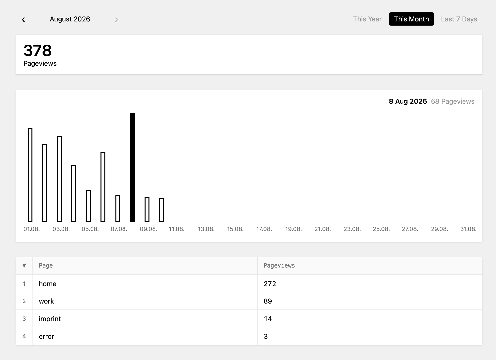

# Kirby Pure Stats

Page-view stats for websites running with Kirby CMS.

On each page visit, the page identifier and date are stored in a local SQLite database and visualized in the Panel.

No IPs. 
No cookies. 
No referrers. 
No identification. 
No visitor profiles. 
No campaigns. 
No funnels. 
No bot filtering. 
**Pure stats.**

## Panel Preview

## Installation

Download or clone this repository into:

`site/plugins/kirby-pure-stats`

Pure Stats will then appear as **Stats** in the Kirby Panel Navigation.

## Features

- Data is stored in `site/stats/pure-stats.sqlite`
- Logged-in Kirby Panel users are excluded from the stats
- Dates are recorded using the server's PHP timezone

## Requirements

- Kirby 5
- PHP with PDO SQLite support

## License

MIT © 2026 Felix Rabe