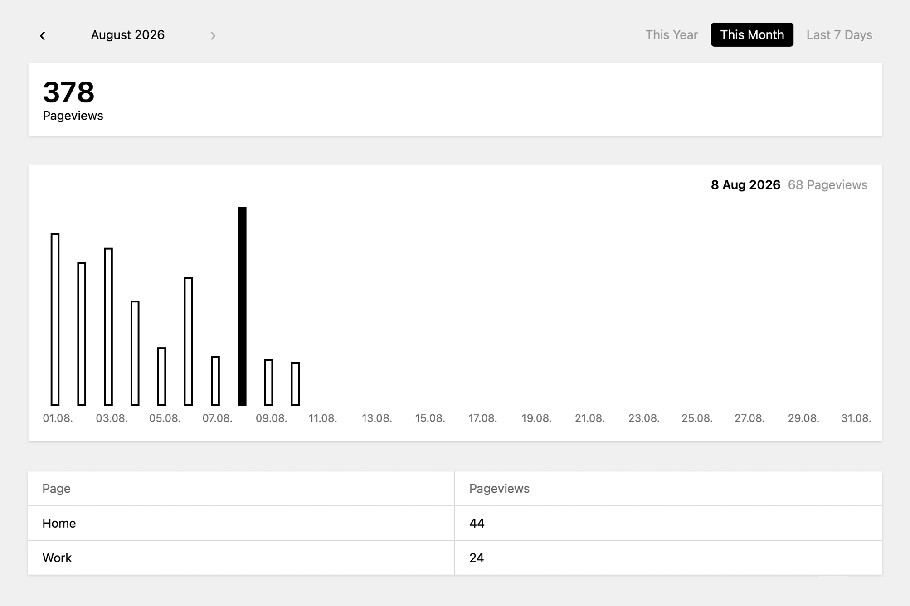

# Kirby Pure Stats

Page-view stats for websites running with Kirby CMS.

On each page visit, the page identifier and date are stored in a local SQLite database and visualized in the Panel.

No IPs. 
No cookies. 
No referrers. 
No identification. 
No visitor profiles. 
No campaigns. 
No funnels. 
No bot filtering. 
**Pure stats.**

## Panel Preview

## Installation

Download or clone this repository into:

`site/plugins/kirby-pure-stats`

Pure Stats will then appear as **Stats** in the Kirby Panel Navigation.

## Features

- Data is stored in `site/stats/pure-stats.sqlite`
- Logged-in Kirby Panel users are excluded from the stats
- Dates are recorded using the server's PHP timezone

## Requirements

- Kirby 5
- PHP with PDO SQLite support

## Editor’s Note

I find it increasingly difficult to evaluate whether analytics tools require user consent. At the same time, adding a consent banner solely for basic website statistics can negatively affect the user experience and inevitably results in incomplete data when users opt out.

Pure Stats proposes a deliberately minimal approach: enough information to understand whether and how a website is being used, without persistent identifiers, user profiles, cookies, or the storage of personal user data.

It is intended for situations where simple, aggregate statistics are sufficient and detailed visitor tracking is neither necessary nor desired.

Pure Stats is not intended as legal advice. Whether consent is required ultimately depends on your implementation and applicable law.

## License

MIT © 2026 Felix Rabe